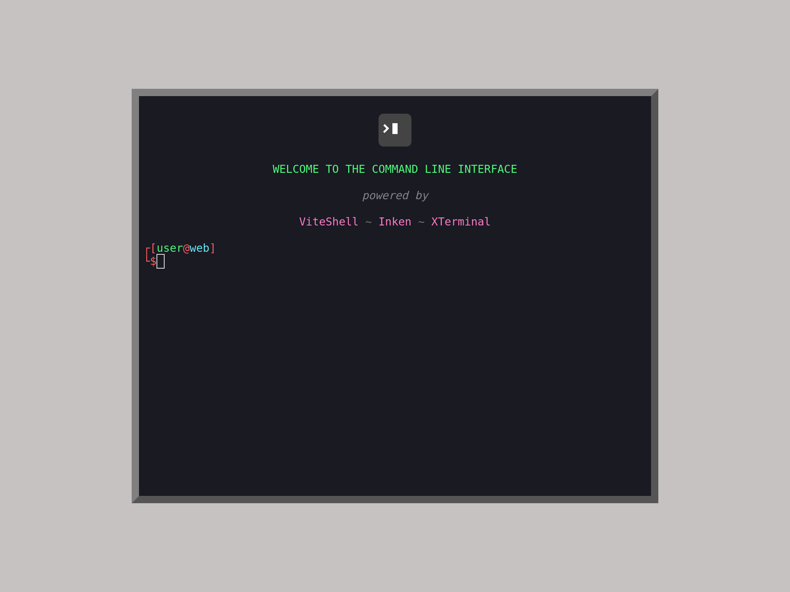

# xterminal-inken-viteshell-starter

Bootstrap your web-based CLI application 

## QuickStart

## Development

1. Use this template or clone this repository
2. Install dependencies: `pnpm install`
3. Run dev server: `pnpm dev`

## Production

1. Build the project: `pnpm build`
2. Preview production build: `pnpm preview`

## Related

- [xterminal](https://github.com/henryhale/xterminal): Build web-based command-line interfaces
- [inken](https://github.com/henryhale/inken): Terminal-like string styling for the browser
- [viteshell](https://github.com/henryhale/viteshell): A minimal shell implementation written in TypeScript

## License

Copyright (c) 2023 [Henry Hale](https://github.com/henryhale/).

Released under the [MIT License](./LICENSE.txt).